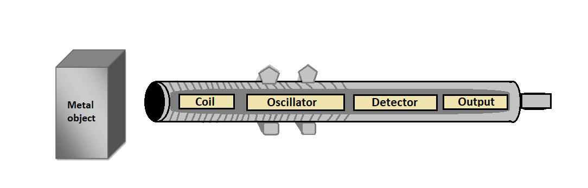
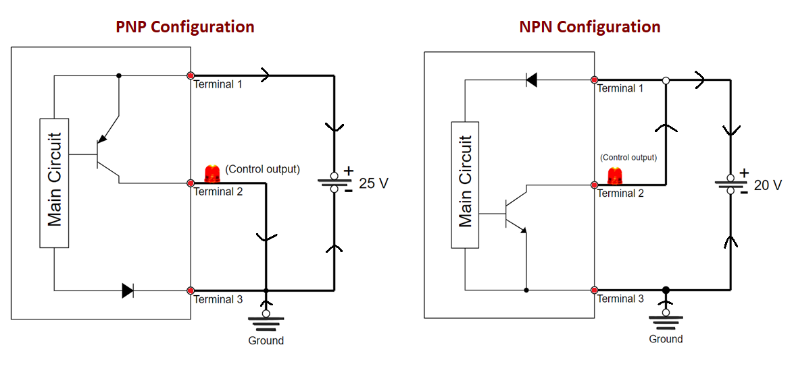
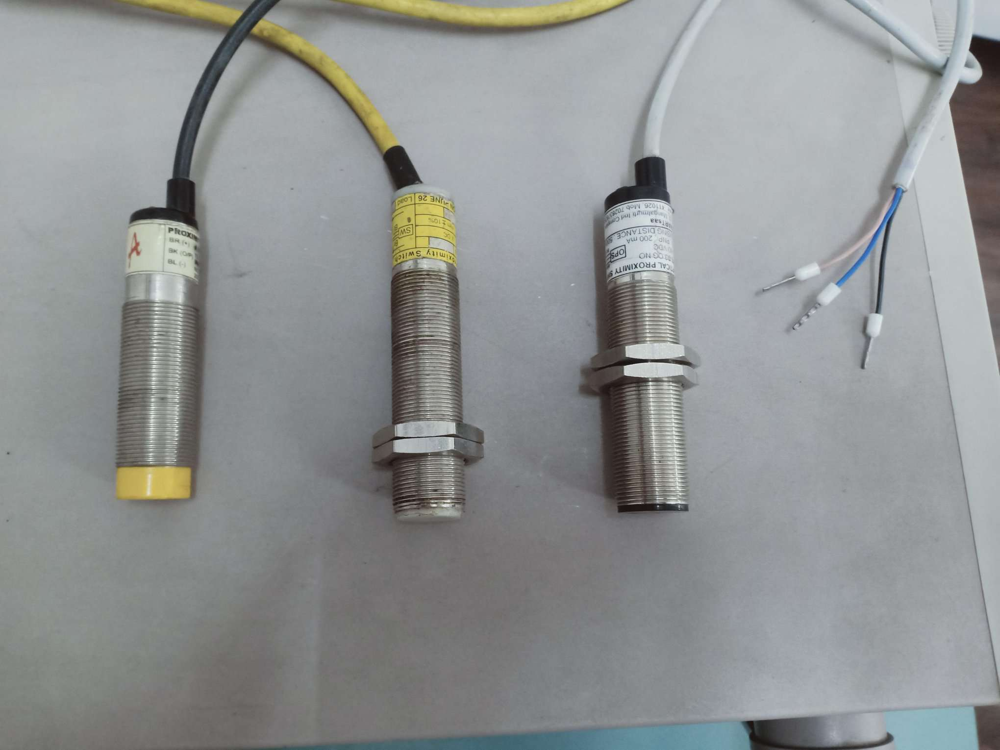
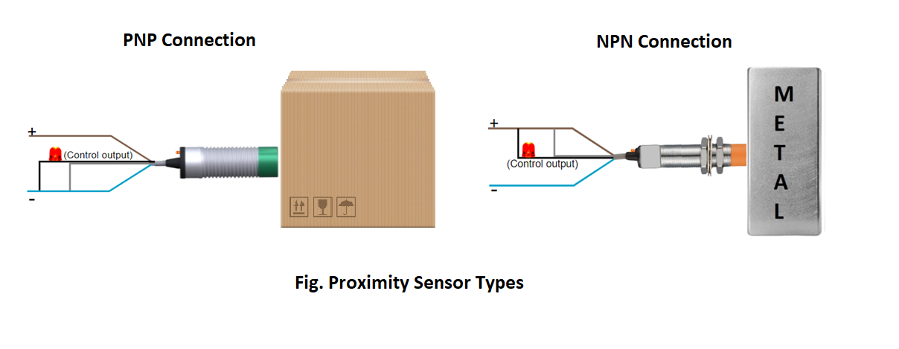

### Theory

Proximity sensors or switches are pilot devices that detect the presence of an object (usually called the target) without physical contact. They are solid-state electronic devices that are completely encapsulated to protect against excessive vibration, liquids, chemicals, and corrosive agents found in the industrial environment. Proximity sensors are used when:
- The object being detected is too small, too lightweight, or too soft to operate a mechanical switch
- Rapid response and high switching rates are required, as in counting or ejection control applications
- An object has to be sensed through non-metallic barriers such as glass, plastic, and paper cartons
- Hostile environments demand improved sealing properties, preventing proper operation of mechanical switches
- Long life and reliable service are required
- A fast electronic control system requires a bounce-free input signal

An inductive proximity sensor is a sensing device that is actuated by a metal object.

When energy is supplied, the oscillator operates to generate a high-frequency field. At this moment, there must not be any conductive material in the high-frequency field. When a metal object enters the high-frequency field, eddy currents are induced in the surface of the target. This results in a loss of energy in the oscillator circuit; consequently, this causes a smaller amplitude of oscillation. The detector circuit recognizes a specific change in amplitude and generates a signal that will turn the solid-state output ON or OFF. When the metal object leaves the sensing area, the oscillator regenerates, allowing the sensor to return to its normal state.

The method of connecting and exciting a proximity sensor will vary with the type of sensor and its application. With a current-sourcing output (PNP) the load is connected between the sensor and ground. Current flows from the sensor through the load to ground (open emitter). With a current-sinking output (NPN) the load is connected between positive supply and sensor. Current flows from the load through the sensor to ground (open collector). Remember, these sensors are used as pilot devices for loads such as starters, contactors, solenoids, and so on. Never directly operate a motor with a proximity sensor.

As a result of solid-state switching of the output, a leakage current flows through the sensor even when the output is turned OFF. Similarly, when the sensor is ON, a small voltage drop is lost across its output terminals. In order to operate properly, a proximity sensor should be powered continuously. The difference between the "operate" and "release" points of the sensor is called hysteresis, or differential travel. Inductive sensors can be actuated in an axial or radial approach. It is important to maintain a minimum air gap between the target and the sensing face to prevent physically damaging the sensors.

A minimum amount of current must be allowed to continuously flow through the sensor in order to maintain operation. When load current is less than this minimum, a bleeder resistor is connected parallel to the load. In order to operate properly, a proximity sensor should be powered continuously. A bypass can be added across the mechanical contact to keep the sensor ready for instantaneous operation. With the sensor ON, a small voltage is lost across its output.

Hysteresis is the distance between the operating point when the target approaches the proximity sensor face and the release point when the target is moving away from the sensor face. It is given as a percentage of the nominal sensing range. Hysteresis is needed to keep proximity sensors from chattering when subjected to shock and vibration, slow-moving targets, or minor disturbances such as electrical noise and temperature drift.
A capacitive proximity sensor is a sensing device that is actuated by conductive and nonconductive materials. The operation of capacitive sensors is also based on the principle of an oscillator. Instead of a coil, however, the active face of a capacitive sensor is formed by two metallic electrodes rather like an "opened" capacitor. The electrodes are placed in the feedback loop of a high-frequency oscillator that is inactive with "no target present." As the target approaches the face of the sensor, it enters the electrostatic field that is formed by the electrodes. This causes an increase in the coupling capacitance, and the circuit begins to oscillate. The amplitude of these oscillations is measured by an evaluating circuit that generates a signal to turn the solid-state output ON or OFF.

In order to actuate inductive sensors, we need a conductive material. Capacitive sensors may be actuated by both conductive materials and by nonconductive materials such as wood, plastics, liquids, sugar, flour, and wheat. Along with this advantage of the capacitive sensor (compared to the inductive sensor) comes some disadvantages. For example, inductive proximity switches may be actuated only by a metal and are insensitive to humidity, dust. dirt, and the like. Capacitive proximity switches, however, can be actuated by any dirt in their environment. For general applications, the capacitive proximity switches are not really an alternative but a supplement to the inductive proximity switches. They are a supplement when there is no metal available for the actuation (e.g., for woodworking machines and for determining the exact level of liquids or powders).

